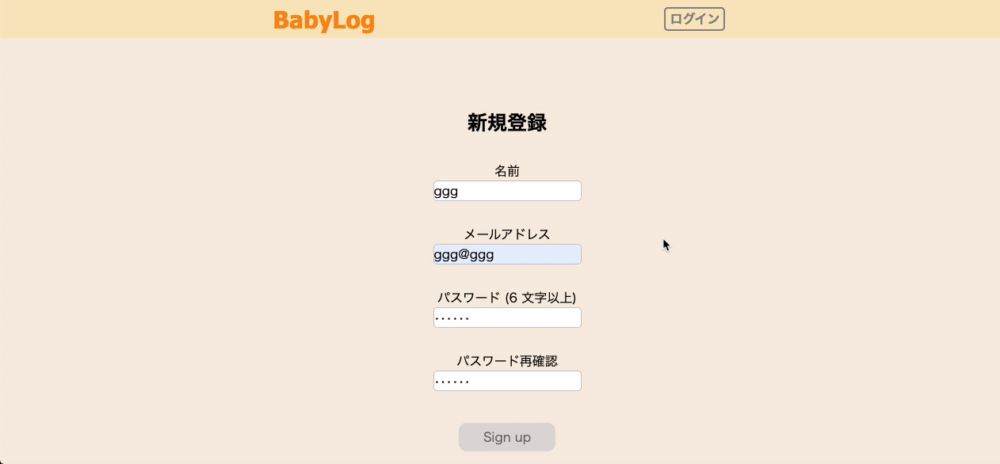
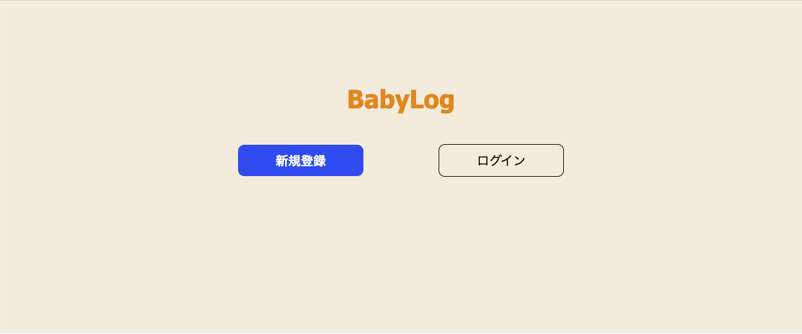
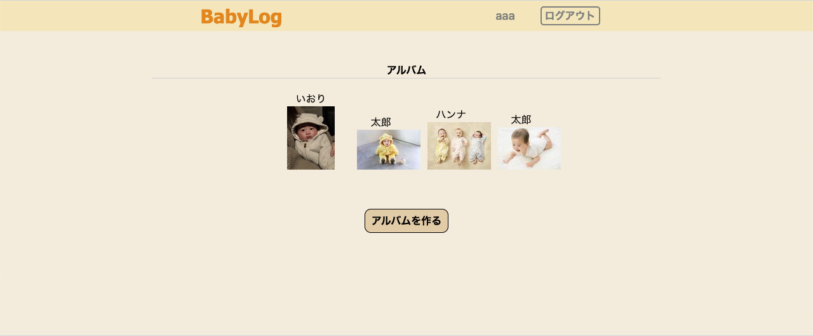
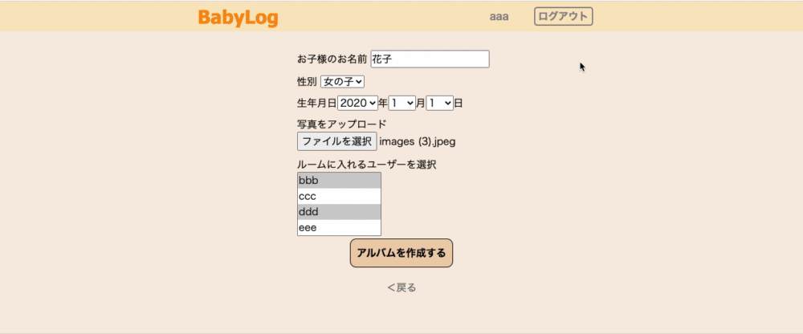
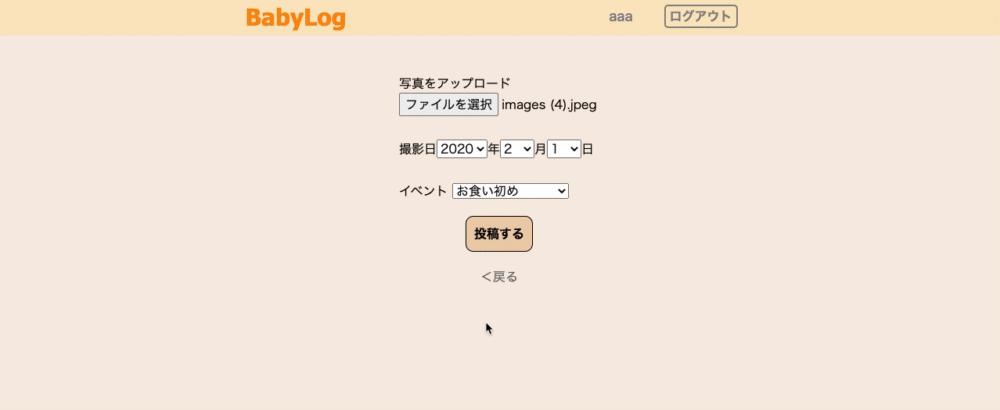
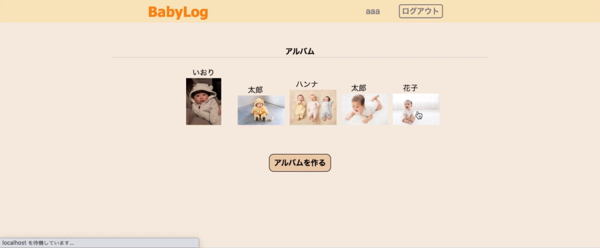

# アプリケーション名
BabyLog

# アプリケーション概要
子供の成長を家族や親族間などで見守れる、写真共有アプリです。

# URL
https://babylog-32573.herokuapp.com/
# アカウント情報
## Basic認証
　ユーザーID: admin  
　パスワード: 2222
## テスト用アカウント
　メールアドレス： aaa@aaa  
　パスワード： aaa111

# 開発環境  
Ruby 2.6.5  
Ruby on Rails  6.0.3.4  
MySQL2 5.6.21  
Github  
VSCode

# 目指した課題解決
・コロナ禍で子供を両親や、親族に会わせづらいが子供の成長を見て欲しい、又は見たい。  
　→**Webアプリケーション上で写真を投稿し共有できる。（乳幼児向け）**  
・誰の写真なのかわかりづらい、観覧できるユーザーを（家族や親族などに）指定したい。  
　→**人物ごとのルームに分けられ、そのルームに入れるユーザーを指定できる**  
 
# 利用方法
・WebブラウザGoogleChromeの最新版を利用してアクセスしてください。  
　＊ただし、デプロイ等で接続できないタイミングをもざいます。その際は少しお時間をおいてから接続してください。  
・接続先、ログイン情報は上記の通りです。  
・同時に複数の方がログインしている場合に、ログインできない可能性がございます。  
・テストアカウントでログイン → トップページからから「アルバムを作る」を押下 → 情報を入力、「アルバムを作成する」押下 → ルームが作成されます。  
・作成したアルバムの写真又は、アルバム名を押下 → 投稿一覧ページから「写真を投稿する」を押下 → 写真が投稿されます。  
・投稿した写真を押下 → 詳細画面からコメントを入力し、コメントするを押下 → コメントが投稿されます。  

# 実装機能についてのGIFと説明
## ①ユーザー管理機能

・deviseを使用しユーザー管理機能を取り入れました。  

## ②トップページ
　  
・ログインしているかどうかで画面の表示が変わります。  
・ログインしているときは、右の画像のように作成したルームの一覧が表示されます。  
・ログインしていないときは、左の画像のような画面になります。  

## ③ルーム作成機能

・ルーム作成ページで情報を入力し「アルバムを作成する」を押下するとルームが作成され、トップページに遷移します。 
・ルームには複数のユーザーを選択することができます。 
・作成したルームを押下すると投稿一覧ページに遷移します。  

## ④写真投稿機能
  
・投稿一覧ページから「写真を投稿する」を押下すると写真投稿ページに遷移します。 
・写真投稿ページで情報を入力し完了を押下すると写真が投稿されます。   
・投稿した写真を押下すると詳細ページに遷移します。  

## ⑤コメント機能
  
・詳細ページのコメント入力欄にコメントを記入して「コメントをする」を押下するとコメントを投稿できます。

#### ⚠️Herokuを利用して公開しているため画像データは定期的に消去され表示されない可能性がございます。

# 実装予定の機能
・投稿一覧ページにて投稿した写真をイベントごとや月ごとにソートできる機能を追加する予定です。  
・ルーム作成時のユーザーの選択で全てのユーザーが選択肢として表示されてしまうので、招待制に変更を検討してます。

# テーブル設計

## users テーブル

| Column               | Type   | Options                   |
| -------------------- | ------ | ------------------------- |
| nickname             | string | null: false               |
| email                | string | null: false, unique: true |
| encrypted_password   | string | null: false               |

### Association

- has_many :room_users
- has_many :rooms, through: :room_users
- has_many :posts
- has_many :comments
- has_one :relationships

## rooms テーブル

| Column        | Type       | Options                        |
| ------------- | ---------- | ------------------------------ |
| baby_name     | string     | null: false                    |
| gender_id     | integer    | null: false                    |
| birthday      | date       | null: false                    |
| room_id       | integer    | null: false                    |
| image         |            | (ActiveStorage)                |

### Association

- has_many :room_users
- has_many :rooms, through: :room_users
- has_many :posts
- has_many :comments
- has_many :relationship

## room_users テーブル

| Column        | Type       | Options                        |
| ------------- | ---------- | ------------------------------ |
| user          | references | null: false, foreign_key: true |
| room          | references | null: false, foreign_key: true |

### Association

- belongs_to :user
- belongs_to :room

## posts テーブル

| Column        | Type       | Options                        |
| ------------- | ---------- | ------------------------------ |
| room          | references | null: false, foreign_key: true |
| event_id      | integer    | null: false, foreign_key: true |
| user _id      | integer    | null: false                    |
| shooting_date | date       | null: false, foreign_key: true |
| image         |            | (ActiveStorage)                |

### Association

- belongs_to :user
- belongs_to :room
- has_many :comments

## comments テーブル

| Column              | Type           | Options                        |
| ------------------- | -------------- | ------------------------------ |
| content             | string         | null: false                    |
| post                | references     | null: false, foreign_key: true |
| user                | references     | null: false, foreign_key: true |
| room                | references     | null: false, foreign_key: true |

### Association

- belongs_to :user
- belongs_to :post
- belongs_to :room

## relationships テーブル

| Column              | Type       | Options                        |
| ------------------- | ---------- | ------------------------------ |
| user_id             | string     | null: false                    |
| relationship_id     | integer    | null: false                    |

### Association

- belongs_to :room
